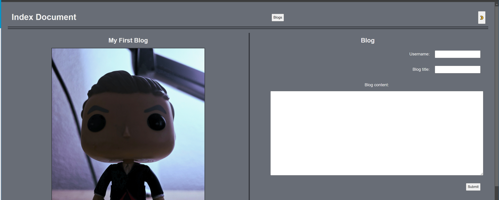
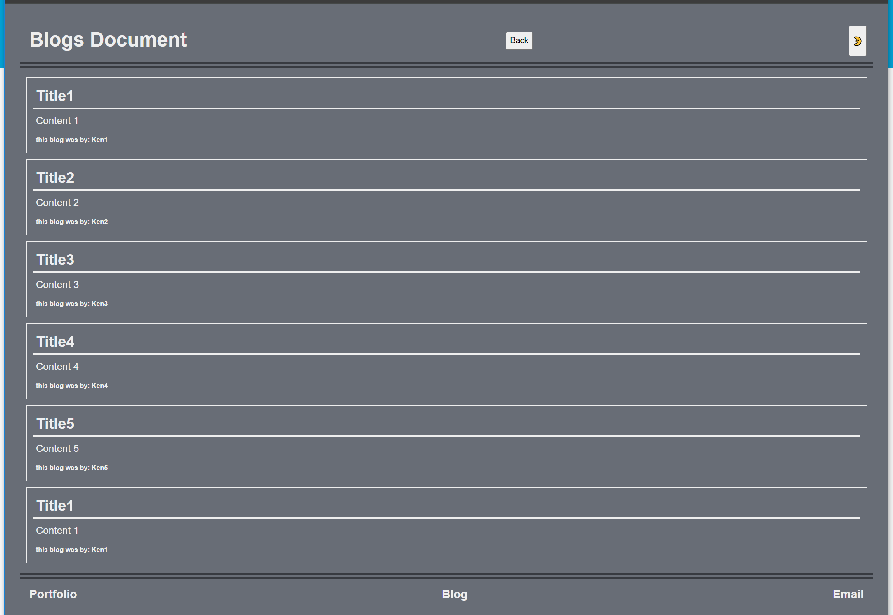

# KW-Linked-Pers-Marketing-Blog

## Description

A marketing student reached out to me and asked for a personal blog site. I completely sympathize with the need for one place to write thoughts and ideas on an ever-changing subject, and was happy to help.

## Installation

NA

## Usage

To use the blog site you type in the relevant information in each section of the prompt, then when you click submit it takes you to the page that stores the blogs. Every field in the blog form is required for submission. There is a blog button in the header of the page to take you to the blog page before submitting a blog, and a back button to return to the main page from the blog page.

Link to the blog website: 

## Credits

Study buddy: [David Evett](https://github.com/davidevett)

[How to redirect from one page to another](https://www.w3schools.com/howto/howto_js_redirect_webpage.asp)

## License

This project uses the MIT License, which is specified in the GitHub Repo